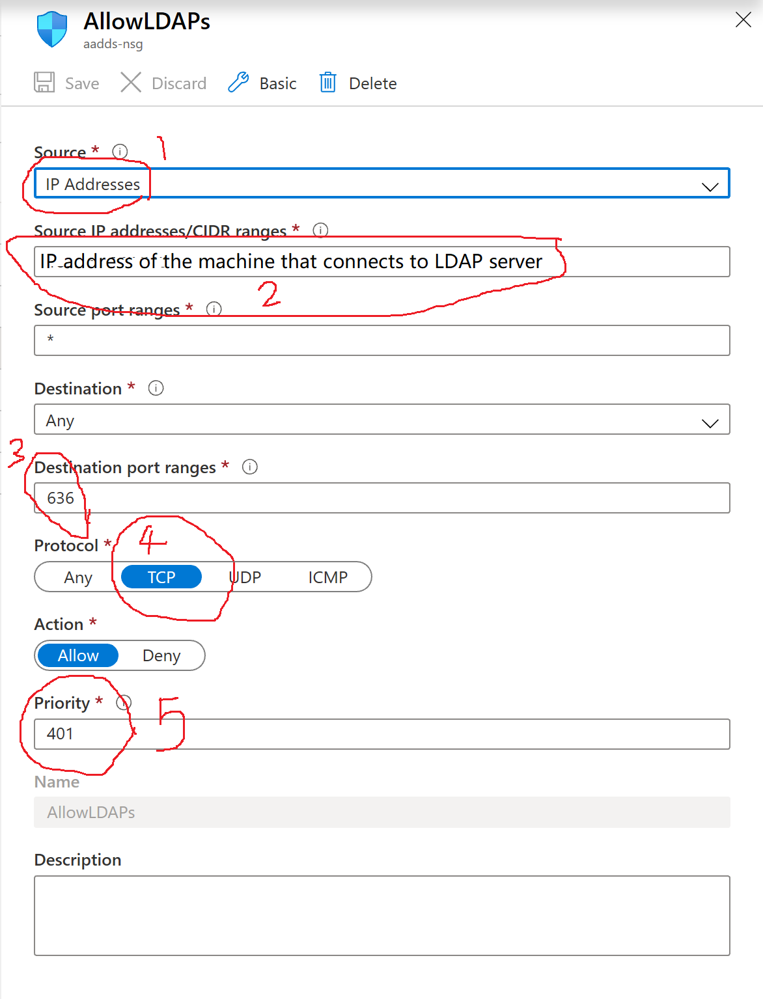

# Integrate Azure Active Directofy with WebLogic Server Manually  
This document will introduce how to configure Active Directory with Weblogic server as Authentication Provider step by step.  
Firstly, set up LDAP server.  Azure AD does not support the Lightweight Directory Access Protocol (LDAP) protocol or Secure LDAP directly. However, it's possible to enable Azure AD Domain Services (Azure AD DS) instance on your Azure AD tenant with properly configured network security groups through Azure Networking to achieve LDAP connectivity[1].  

## Step 1: Create a cloud-only user if you don't have one  
If you have a cloud-only user in your subscription, please skip this step.  
Before creating Azure AD DS, please follow the [Cloud Only User](cloud-only-user.md) to create a cloud-only user for LADP connection. We will use the user to login LDAP server in the following steps.  

## Step 2: Create domain service and configure LDAP  
If you have a domain service, please go to configure LDAP.  
* Create a domain service  
Please follow the [Create Domain Service](create-domain-service.md) to create your domain service, after finishing deployment, a running domain servcie is created, such as example.com. Please remeber to confige DNS!  
We have to reset user password before login to the domain. Please follow [Cloud Only User](cloud-only-user.md) to reset password, it takes about half an hour to work correctly.  

Please follow the [Configure ADDS LDAP](configure-ad-ds-ldap.md) to configure secure LDAP for you domain, after successful deployment, we will have LDAP server running, such as ldaps.example.com. SSL is only allow to access the ldap server, port is 636.  
We have to add a rule to network security group to allow access to LDAP server.  

Please go to your resource group, click adds-nsg, go to Settings, click Inbound security rules, click Add, and input your information as following, then click save.  

Please follow the [Configure ADDS LDAP](configure-ad-ds-ldap.md) to test LDAP server.  

## Step 3: Configure WLS LDAP  
Please follow the [Configure WLS LDAP](configure-wls-ldap.md) to configure WebLogic Server.  

You will integrate Active Directory with WebLogic Server after finishing above steps. Well done!  

For troubleshooting, please go to [troubleshooting](troubleshooting.md)   

## Referrence
1. [Can I set up a secure LDAP connection with Azure AD?](https://docs.microsoft.com/en-us/azure/active-directory/fundamentals/active-directory-faq)  
2. [Configure Active Directory with Weblogic server as Authentication Provider](https://insideclouldworld.wordpress.com/2016/08/21/configure-active-directory-with-weblogic-server-as-authentication-provider/)  
3. [Configure secure LDAP for an Azure Active Directory Domain Services managed domain](https://docs.microsoft.com/en-us/azure/active-directory-domain-services/tutorial-configure-ldaps)  
4. [Configuring WebLogic to use LDAP](https://docs.oracle.com/en/middleware/enterprise-data-quality/12.2.1.3/secure/configuring-weblogic-use-ldap.html#GUID-2E31FC0B-6934-441E-AA4B-3F57A70ABA68)  