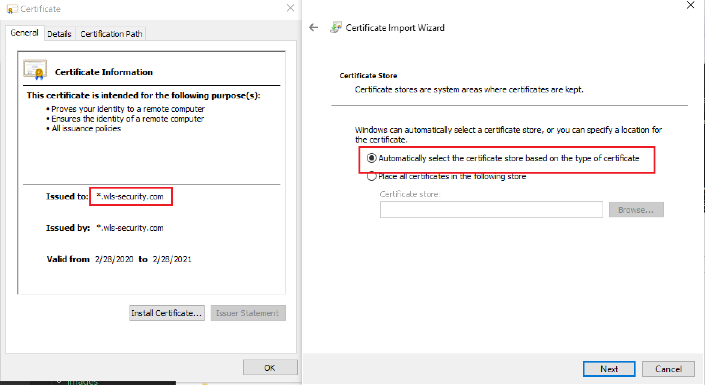
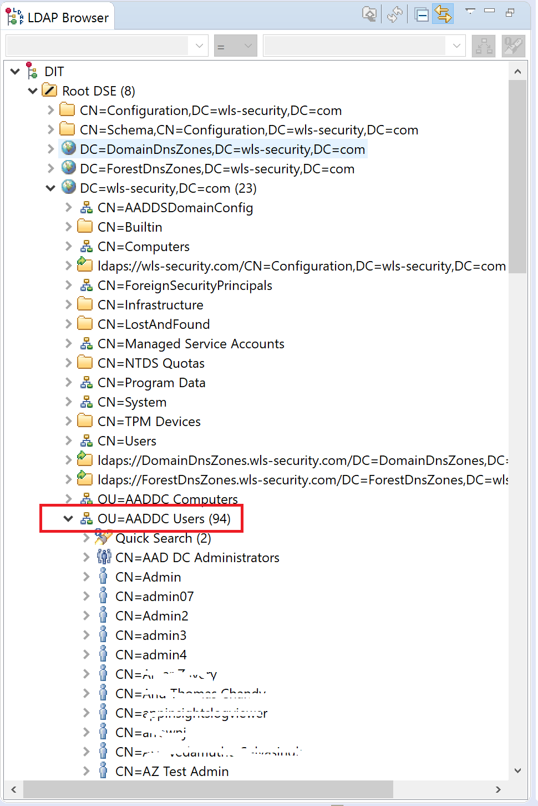
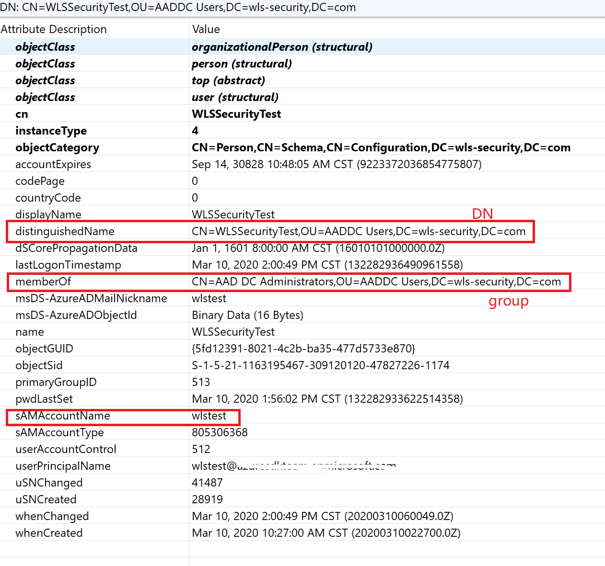

This document describe how to configure domain service LDAP.  

## Configure Azure Active Directory Domain Service LDAP  
We will follow [Tutorial: Configure secure LDAP for an Azure Active Directory Domain Services managed domain](https://docs.microsoft.com/en-us/azure/active-directory-domain-services/tutorial-configure-ldaps) to secure LDAP of wls-security.com.  

### Step 1 Create a certificate for secure LDAP  
Follow [Create a certificate for secure LDAP](https://docs.microsoft.com/en-us/azure/active-directory-domain-services/tutorial-configure-ldaps#create-a-certificate-for-secure-ldap) to create a certificate for LDAP server.  
If you don't want to create one, you can use the testing ca first.  
[azure-ad-ds.pfx](ca/azure-ad-ds.pfx) is for server.  
[azure-ad-ds-client.cer](ca/azure-ad-ds-client.cer) is for client. Will use in WebLogic Sever SSL configuration.  

### Step 2 Enable secure LDAP for Azure AD DS
1. Go to domain wls-security.com  
2. Click Secure LDAP  
3. Enable LDAP and input certificate as following:  
  

### Step 3 Lock down secure LDAP access over the internet
Please follow [Lock down secure LDAP access over the internet](https://docs.microsoft.com/en-us/azure/active-directory-domain-services/tutorial-configure-ldaps#lock-down-secure-ldap-access-over-the-internet) to add you machine ip address to network security group.  
The step is very important for remote access to LDAP server.  
If you don't know your public ip, goole "what is my ip", you will get it.  

### Step 4 Configure DNS zone for external access
Please follow [Configure DNS zone for external access](https://docs.microsoft.com/en-us/azure/active-directory-domain-services/tutorial-configure-ldaps#configure-dns-zone-for-external-access) to configure dns zone.

### Step 5 Install client CA  
Install azure-ad-ds-client.cer to you machine to access the ldap server.  

### Step 6 Test Managed Domain
Though we can use ldp.exe to test the domain, Apache Directory Studio is recommended for easy query.  

* Use ldp.exe to test managed domain  
You can follow [Test queries to the managed domain](https://docs.microsoft.com/en-us/azure/active-directory-domain-services/tutorial-configure-ldaps#test-queries-to-the-managed-domain) to use ldp.exe.  

Note: You have to connect to ldap server successfully, then bind a user.  
Address of ldap server is ldaps.wls-security.com, port is 636, domain is wls-security.com. AD DS is only SSL access now.  
Pay attension to the user name, actually, we create user wlstest@yourtenant.com, just input the user name. Besides, the user must be belonging to the AAD DC Administrators group.  
    

* Use Apache Directory Studio
1. Download Apache Directory Studio from https://directory.apache.org/studio/downloads.html and install.  
2. Open Apache Directory Studio, Select menu LDAP -> new connection.  
3. Network Parameter:  
   Hostname: ldaps.wls-security.com  
   Port: 636  
   Encryption method: Use SSL encryption  
   Click Certificate Validation and add azure-ad-ds-client.cer  
   Click Check NetWork Parameter, will success if the informations are correct.  
     

4. Click next  
5. Authentication  
   Authentication Method: Simple Authentication  
   Bind DN or user: CN=WLSSecurityTest,OU=AADDC Users,DC=wls-security,DC=com  
   The CN is avaliable from Azure Potal -> Users -> click your user -> Identity-> Name  
     
   Bind Password: the password that you reset.  
   Click check Authentication, it should pass.  

6. You can get user base DN and group base DN from the LDAP browser, which is very useful for WebLogic LDAP setting.  
Take wlstest as an example:  
DistingishedName: CN=WLSSecurityTest,OU=AADDC Users,DC=wls-security,DC=com  
Group DistingishedName: CN=AAD DC Administrators,OU=AADDC Users,DC=wls-security,DC=com  
Base DNs for user and group are the same: OU=AADDC Users,DC=wls-security,DC=com  
      
      

   
 

 